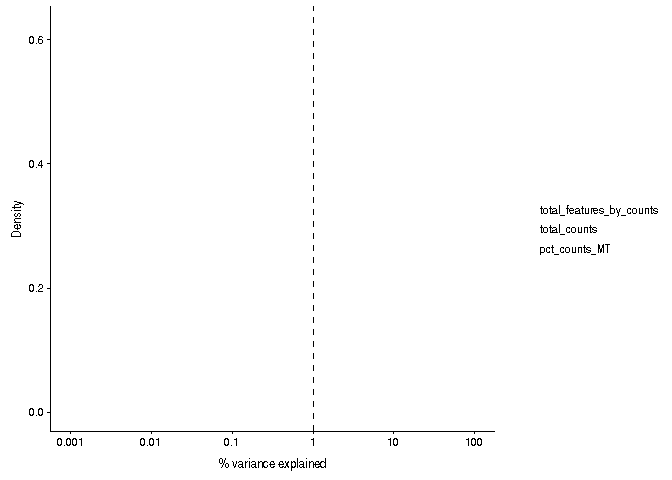
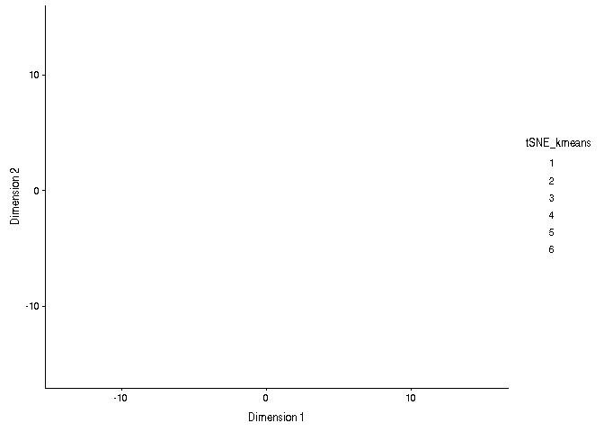

Exploratory analysis pipeline; Hemberg lab
================
German Novakovskiy
December 14, 2018

    ## Loading required package: SingleCellExperiment

    ## Loading required package: SummarizedExperiment

    ## Loading required package: GenomicRanges

    ## Loading required package: stats4

    ## Loading required package: BiocGenerics

    ## Loading required package: parallel

    ## 
    ## Attaching package: 'BiocGenerics'

    ## The following objects are masked from 'package:parallel':
    ## 
    ##     clusterApply, clusterApplyLB, clusterCall, clusterEvalQ,
    ##     clusterExport, clusterMap, parApply, parCapply, parLapply,
    ##     parLapplyLB, parRapply, parSapply, parSapplyLB

    ## The following objects are masked from 'package:stats':
    ## 
    ##     IQR, mad, sd, var, xtabs

    ## The following objects are masked from 'package:base':
    ## 
    ##     anyDuplicated, append, as.data.frame, basename, cbind,
    ##     colMeans, colnames, colSums, dirname, do.call, duplicated,
    ##     eval, evalq, Filter, Find, get, grep, grepl, intersect,
    ##     is.unsorted, lapply, lengths, Map, mapply, match, mget, order,
    ##     paste, pmax, pmax.int, pmin, pmin.int, Position, rank, rbind,
    ##     Reduce, rowMeans, rownames, rowSums, sapply, setdiff, sort,
    ##     table, tapply, union, unique, unsplit, which, which.max,
    ##     which.min

    ## Loading required package: S4Vectors

    ## 
    ## Attaching package: 'S4Vectors'

    ## The following object is masked from 'package:base':
    ## 
    ##     expand.grid

    ## Loading required package: IRanges

    ## Loading required package: GenomeInfoDb

    ## Loading required package: Biobase

    ## Welcome to Bioconductor
    ## 
    ##     Vignettes contain introductory material; view with
    ##     'browseVignettes()'. To cite Bioconductor, see
    ##     'citation("Biobase")', and for packages 'citation("pkgname")'.

    ## Loading required package: DelayedArray

    ## Loading required package: matrixStats

    ## 
    ## Attaching package: 'matrixStats'

    ## The following objects are masked from 'package:Biobase':
    ## 
    ##     anyMissing, rowMedians

    ## 
    ## Attaching package: 'DelayedArray'

    ## The following objects are masked from 'package:matrixStats':
    ## 
    ##     colMaxs, colMins, colRanges, rowMaxs, rowMins, rowRanges

    ## The following objects are masked from 'package:base':
    ## 
    ##     aperm, apply

    ## 
    ## Attaching package: 'zinbwave'

    ## The following objects are masked from 'package:clusterExperiment':
    ## 
    ##     nFeatures, nSamples

    ## Loading required package: princurve

    ## Warning: replacing previous import 'SingleCellExperiment::weights' by
    ## 'stats::weights' when loading 'slingshot'

    ## Loading required package: foreach

    ## Loading required package: iterators

    ## Loading required package: splines

    ## Loaded gam 1.16

    ## 
    ## Attaching package: 'dplyr'

    ## The following object is masked from 'package:matrixStats':
    ## 
    ##     count

    ## The following object is masked from 'package:Biobase':
    ## 
    ##     combine

    ## The following objects are masked from 'package:GenomicRanges':
    ## 
    ##     intersect, setdiff, union

    ## The following object is masked from 'package:GenomeInfoDb':
    ## 
    ##     intersect

    ## The following objects are masked from 'package:IRanges':
    ## 
    ##     collapse, desc, intersect, setdiff, slice, union

    ## The following objects are masked from 'package:S4Vectors':
    ## 
    ##     first, intersect, rename, setdiff, setequal, union

    ## The following objects are masked from 'package:BiocGenerics':
    ## 
    ##     combine, intersect, setdiff, union

    ## The following objects are masked from 'package:stats':
    ## 
    ##     filter, lag

    ## The following objects are masked from 'package:base':
    ## 
    ##     intersect, setdiff, setequal, union

    ## Loading required package: limma

    ## 
    ## Attaching package: 'limma'

    ## The following object is masked from 'package:BiocGenerics':
    ## 
    ##     plotMA

    ## 
    ## Attaching package: 'edgeR'

    ## The following object is masked from 'package:SingleCellExperiment':
    ## 
    ##     cpm

    ## Loading required package: ggplot2

    ## 
    ## Attaching package: 'scater'

    ## The following object is masked from 'package:limma':
    ## 
    ##     plotMDS

    ## The following objects are masked from 'package:dplyr':
    ## 
    ##     arrange, filter, mutate, rename

    ## The following object is masked from 'package:clusterExperiment':
    ## 
    ##     plotHeatmap

    ## The following object is masked from 'package:S4Vectors':
    ## 
    ##     rename

    ## The following object is masked from 'package:stats':
    ## 
    ##     filter

    ## 
    ## Attaching package: 'Matrix'

    ## The following object is masked from 'package:S4Vectors':
    ## 
    ##     expand

    ## Loading required package: numDeriv

    ## Loading required package: VGAM

    ## 
    ## Attaching package: 'VGAM'

    ## The following object is masked from 'package:gam':
    ## 
    ##     s

    ## Loading required package: DDRTree

    ## Loading required package: irlba

    ## Loading required package: Rcpp

[10X Genomics](https://ucdavis-bioinformatics-training.github.io/2017_2018-single-cell-RNA-sequencing-Workshop-UCD_UCB_UCSF/day1/Expression_Matrix.html)

Analysis of Francis's data: differentiation of hESC towards DE; one time point - 36 hours. 10X Genomics data, The 10X Genomics Chromium system analyses the 3'-ends of transcripts. This leads to a more cost effective analysis of gene expression from thousands of cells.

Samples:

Sox17-mNeonGreen H1 cells, 24h culture w/ Activin A+CHIR -&gt; 12h culture Activin A+1/10CHIR;

Day 1: RB + 0.2% FBS + 1:5000 ITS +100ng/mL Activin A + 3uM CHIR99021

Next 12 hours: RB + 0.2% FBS + 1:2000 ITS +100ng/mL Activin A + 0.3uM CHIR99021

\*RB: RPMI1640 + 1x Glutamax + 1/200 Penicillin/Streptomycin

Process:

-   Added mNeonGreen into GRCh38 as reference

(Follow the instruction on 10xGenomics)

-   Run cellranger mkfastq

-   Run cellranger count

The 10X Genomics workflow for single cell RNA-seq is shown [here](https://community.10xgenomics.com/t5/10x-Blog/Single-Cell-RNA-Seq-An-Introductory-Overview-and-Tools-for/ba-p/547).

Pre-processing
--------------

Information about input data formats can be found [here](https://support.10xgenomics.com/single-cell-gene-expression/software/pipelines/latest/output/matrices).

MEX matrix is sparse matrix. I have 33539 genes and 6320 cells (barcode of which was identified), overall it's 33539\*6320 matrix with 211966480 elements. However, matrix.mtx.gz contains pointers only to non-zero elements: 15780312 (7.5%).

Note: There is a problem in the pipeline: Low Fraction Reads in Cells (50.2%). Ideal &gt; 70%. Application performance may be affected. Many of the reads were not assigned to cell-associated barcodes. This could be caused by high levels of ambient RNA or by a significant population of cells with a low RNA content, which the algorithm did not call as cells.

Loading the data:

``` r
#getwd()
#UMI counts are not normalized
matrix_dir <-  "../../Sox17Ng_36h_German/filtered_feature_bc_matrix/"

barcode.path <- paste0(matrix_dir, "barcodes.tsv")
features.path <- paste0(matrix_dir, "genes.tsv")
matrix.path <- paste0(matrix_dir, "matrix.mtx")

mat <- readMM(file = matrix.path)
feature.names <- read.delim(features.path, 
                           header = FALSE,
                           stringsAsFactors = FALSE)
barcode.names <-  read.delim(barcode.path, 
                           header = FALSE,
                           stringsAsFactors = FALSE)

colnames(mat) <-  barcode.names$V1
rownames(mat) <-  feature.names$V1

#rm(barcode.names, feature.names)

#doing all this in one line
#molecules <- read10X(mtx = "../../Sox17Ng_36h_German/filtered_feature_bc_matrix/matrix.mtx.gz", genes =
#            "../../Sox17Ng_36h_German/filtered_feature_bc_matrix/features.tsv.gz", barcodes =
#            "../../Sox17Ng_36h_German/filtered_feature_bc_matrix/barcodes.tsv.gz", path = NULL, DGEList = FALSE)
```

We didn't use any spike-ins.

``` r
umi <- SingleCellExperiment(assays = list(counts = mat))
umi
```

    ## class: SingleCellExperiment 
    ## dim: 33539 6320 
    ## metadata(0):
    ## assays(1): counts
    ## rownames(33539): mNeonGreen_mNeonGreen GRCh38_____ENSG00000243485
    ##   ... GRCh38_____ENSG00000277475 GRCh38_____ENSG00000268674
    ## rowData names(0):
    ## colnames(6320): AAACCTGAGATGGGTC-1 AAACCTGCATACGCTA-1 ...
    ##   TTTGTCATCCTCGCAT-1 TTTGTCATCTGGTATG-1
    ## colData names(0):
    ## reducedDimNames(0):
    ## spikeNames(0):

``` r
keep_feature <- rowSums(counts(umi) > 0) > 0
umi <- umi[keep_feature, ]
dim(umi)
```

    ## [1] 23148  6320

Mat is sparse matrix that has only positions of non-zero elements

``` r
# Remove undetected genes
mat <- na.omit(mat)
mat <- mat[rowSums(mat)>0,]
dim(mat)
```

    ## [1] 23148  6320

``` r
#converting gene column to actual gene symbols (removing GRCh38____)
x <- sapply(feature.names$V2, function(x){unlist(strsplit(x, split = "_____", fixed=TRUE))[2]})
names(x) <- NULL
x[1] <- "mNeonGreen"
feature.names$V4 <- x
rm(x)
```

Define control features (genes) - mitochondrial genes from [here](http://jdblischak.github.io/singleCellSeq/analysis/qc-filter-ipsc.html).

``` r
mitochondrial_genes <- c("GRCh38_____ENSG00000198899", "GRCh38_____ENSG00000198727", "GRCh38_____ENSG00000198888",
    "GRCh38_____ENSG00000198886", "GRCh38_____ENSG00000212907", "GRCh38_____ENSG00000198786",
    "GRCh38_____ENSG00000198695", "GRCh38_____ENSG00000198712", "GRCh38_____ENSG00000198804",
    "GRCh38_____ENSG00000198763", "GRCh38_____ENSG00000228253", "GRCh38_____ENSG00000198938",
    "GRCh38_____ENSG00000198840")


isSpike(umi, "MT") <- rownames(umi) %in% mitochondrial_genes
```

Calculate the quality metrics:

``` r
umi <- calculateQCMetrics(
    umi,
    feature_controls = list( 
        MT = isSpike(umi, "MT")
    )
)
```

    ## Warning in calculateQCMetrics(umi, feature_controls = list(MT =
    ## isSpike(umi, : spike-in set 'MT' overwritten by feature_controls set of the
    ## same name

Next we consider the total number of RNA molecules (since we have UMI here) detected per sample. Wells with few reads/molecules are likely to have been broken or failed to capture a cell, and should thus be removed.

``` r
hist(
    umi$total_counts,
    breaks = 100
)
abline(v = 10000, col = "red")
```

 (2700 cells have UMI counts more than 10000...).

``` r
table(umi$total_counts > 10000)
```

    ## 
    ## FALSE  TRUE 
    ##  3620  2700

In addition to ensuring sufficient sequencing depth for each sample, we also want to make sure that the reads are distributed across the transcriptome. Thus, we count the total number of unique genes detected in each sample.

The average number of genes detected per cell really depends on the cell type. Large, fast growing cells like those from culture or from tumours will often have 5,000 or more genes detected per cell on average. Primary immune cells that are smaller, and less transcriptionally active may only have 1,000 to 3,000 genes detected per cell.

``` r
#total_features_by_counts - the number of genes that have expression values above the detection limit
hist(
    umi$total_features_by_counts,
    breaks = 100
)
abline(v = 3000, col = "red")
```

 (2659 cells have more than 3000 of identified genes...).

``` r
table(umi$total_features_by_counts > 3000)
```

    ## 
    ## FALSE  TRUE 
    ##  3661  2659

Ratio between MT gene RNAs and endogenous RNAs - on y axis, percentage of all UMI counts that comes from MT genes; x axis - number of genes that can be detected, per cell:

``` r
#plotPhenoData
plotColData(umi, x="total_features_by_counts", y="pct_counts_MT")
```

    ## Warning in grid.Call.graphics(C_points, x$x, x$y, x$pch, x$size): semi-
    ## transparency is not supported on this device: reported only once per page


``` r
#abline(h = 10, col = "red")
```

We see that there is a big fraction of cells, with high expression of mitochondrial genes (&gt;10% of total counts in a cell). Noteworthy, those cells also have small number of detected genes. Here is the [reference](https://genomebiology.biomedcentral.com/articles/10.1186/s13059-016-0888-1) of why it's bad:

There is an extensive literature on the relationship between mtDNA, mitochondrially localized proteins, and cell death \[34, 35\]. However, upregulation of RNA levels of mtDNA in broken cells suggests losses in cytoplasmic content. In a situation where cell membrane is broken, cytoplasmic RNA will be lost, but RNAs enclosed in the mitochondria will be retained.

(In 2051 cells more than 10% of counts comes from mitochondrial genes).

``` r
table(umi$pct_counts_MT > 10)
```

    ## 
    ## FALSE  TRUE 
    ##  4269  2051

Performing manual cell filtering by expression, total counts of expressed genes, and by MT genes:

``` r
#filtering by library size
keep_feature_library <- umi$total_counts > 10000
umi <- umi[,keep_feature_library]

#filtering by number of expressed genes
keep_feature_genes <- umi$total_features_by_counts > 3000
umi <- umi[,keep_feature_genes]

#filtering by expression of MT genes
keep_feature_MT <- umi$pct_counts_MT < 10
umi <- umi[,keep_feature_MT]

dim(umi)
```

    ## [1] 23148  2645

In addition to removing cells with poor quality, it is usually a good idea to exclude genes where we suspect that technical artefacts may have skewed the results. Moreover, inspection of the gene expression profiles may provide insights about how the experimental procedures could be improved.

It is often instructive to consider the number of reads consumed by the top 50 expressed genes.

``` r
plotHighestExprs(umi)
```

    ## Warning in grid.Call.graphics(C_points, x$x, x$y, x$pch, x$size): semi-
    ## transparency is not supported on this device: reported only once per page


Six most expressed genes:

1.  ENSG00000140988 - 40S ribosomal protein S2
2.  ENSG00000231500 - 40S ribosomal protein S18
3.  ENSG00000229117 - 60S ribosomal protein L41
4.  ENSG00000137818 - 60S acidic ribosomal protein P1
5.  ENSG00000105372 - 40S ribosomal protein S19
6.  ENSG00000142541 - 60S ribosomal protein L13a

We see that ribosomal genes are the top of counts. But these encode for ribosomal protein, not ribosomal RNA.

Allen: we should not remove ribosomal or MT genes before dimensionality reduction or clustering; if you’re tossing them out before DR you’re just compromising your ability to resolve clusters.

From this [source](https://ppapasaikas.github.io/BC2_SingleCell/#13_cell_and_gene_filtering): In practice we suggest removing mitochondrial/ribosomal protein genes during the very first steps of the analysis (as they can be a source of large spurious variance between cells). In particular this filtering step should be performed before the filtering of underdispersed genes (mean-variance based filtering). It is only for illustration purposes that these genes were carried through up to this point in this tutorial

Now gene filtering.

It is typically a good idea to remove genes whose expression level is considered “undetectable”. We define a gene as detectable if at least two cells contain more than 1 transcript from the gene.

``` r
filter_genes <- apply(
    counts(umi), 
    1, 
    function(x) length(x[x > 1]) >= 2
)

#rowData(umi)$use <- filter_genes
table(filter_genes)
```

    ## filter_genes
    ## FALSE  TRUE 
    ## 10732 12416

``` r
umi <- umi[filter_genes,]
dim(umi)
```

    ## [1] 12416  2645

``` r
assay(umi, "logcounts") <- log2(counts(umi) + 1)
```

Just a log-transformation is not enough to account for different technical factors between the cells (e.g. sequencing depth). Therefore, please do not use logcounts\_raw for your downstream analysis, instead as a minimum suitable data use the logcounts slot of the SingleCellExperiment object, which not just log-transformed, but also normalised by library size (e.g. CPM normalisation)

Data visualization
------------------

``` r
endog_genes <- !rowData(umi)$is_feature_control
```

``` r
x <- runPCA(
    umi[endog_genes, ],
    exprs_values = "logcounts",
    #size_by = "total_features_by_counts",
    ntop = 500
)
plotPCASCE(x, size_by = "total_features_by_counts")
```

    ## Warning: 'add_ticks' is deprecated.
    ## Use '+ geom_rug(...)' instead.

    ## Warning in grid.Call.graphics(C_points, x$x, x$y, x$pch, x$size): semi-
    ## transparency is not supported on this device: reported only once per page


``` r
x <- runTSNE(
    umi[endog_genes, ],
    exprs_values = "logcounts",
    #perplexity = 600,
    #colour_by = "batch",
    #size_by = "total_features_by_counts",
    #shape_by = "individual",
    set.seed = 123456
)
plotTSNE(x)
```

    ## Warning: 'add_ticks' is deprecated.
    ## Use '+ geom_rug(...)' instead.

    ## Warning in grid.Call.graphics(C_points, x$x, x$y, x$pch, x$size): semi-
    ## transparency is not supported on this device: reported only once per page


``` r
plotExplanatoryPCs(
    umi[endog_genes, ],
    type = "find-pcs",
    exprs_values = "logcounts",
    variable = "total_features_by_counts"
)
```

    ## Warning in grid.Call.graphics(C_lines, x$x, x$y, index, x$arrow): semi-
    ## transparency is not supported on this device: reported only once per page


We can see that PC1 can be almost completely explained by the number of detected genes. The proportion of genes reported as expressed explains a substantial part of observed variability and that this quantity varies systematically across experimental batches!

``` r
plotExplanatoryVariables(
    umi[endog_genes, ],
    #type = "expl",
    exprs_values = "logcounts",
    variables = c(
        "total_features_by_counts",
        "total_counts",
        "pct_counts_MT"
    )
)
```

    ## Warning in grid.Call.graphics(C_lines, x$x, x$y, index, x$arrow): semi-
    ## transparency is not supported on this device: reported only once per page



A density plot is created for each variable, showing the distribution of R-squared across all genes. So basically it means that for a lot of genes we can achieve good regression fit for expression value, by using only number of detected genes as a predictor, or total counts (library sizes).

There is no relationship between gene length and mean expression (in terms of UMI counts) so FPKM & TPM are inappropriate for this dataset (it makes sense because the end of the transcript which contains the UMI was preferentially sequenced:

``` r
#y <- sapply(rownames(umi), function(x){ unlist(strsplit(x, split='_____', fixed=TRUE))[2] })
#y[1] <- "Neogreen"
#names(y) <- NULL
#x <- umi
#rownames(x) <- y

#x <- getBMFeatureAnnos(
#    x,
#    filters = "ensembl_gene_id", 
#    attributes = c(
#        "ensembl_gene_id",
#        "hgnc_symbol",
#        "chromosome_name",
#        "start_position",
#        "end_position"
#    ), 
#    biomart = "ENSEMBL_MART_ENSEMBL", 
#    dataset = "hsapiens_gene_ensembl",
#    host = "www.ensembl.org"
#)

#x.ann <- x[!is.na(rowData(x)$ensembl_gene_id), ]

#eff_length <- 
#    abs(rowData(x.ann)$end_position - rowData(x.ann)$start_position) / 1000

#plot(eff_length, rowMeans(counts(x.ann)))
```

READ AND EXPLORE - WHAT IS THE BEST NORMALIZATION STRATEGY. IS IT [RUV](https://www.ncbi.nlm.nih.gov/pmc/articles/PMC4404308/)?

Scran normalization (GO WITH IT):

``` r
qclust <- quickCluster(umi, min.size = 30)
umi <- computeSumFactors(umi, sizes = 15, clusters = qclust)
umi <- normalize(umi)
```

    ## Warning in .get_all_sf_sets(object): spike-in set 'MT' should have its own
    ## size factors

``` r
x <- runPCA(
    umi[endog_genes, ]
)

plotPCA(
    x,
    size_by = "total_features_by_counts"
)
```

    ## Warning: 'add_ticks' is deprecated.
    ## Use '+ geom_rug(...)' instead.

    ## Warning in grid.Call.graphics(C_points, x$x, x$y, x$pch, x$size): semi-
    ## transparency is not supported on this device: reported only once per page


``` r
plotTSNE(x)
```

    ## Warning: 'add_ticks' is deprecated.
    ## Use '+ geom_rug(...)' instead.

    ## Warning in grid.Call.graphics(C_points, x$x, x$y, x$pch, x$size): semi-
    ## transparency is not supported on this device: reported only once per page


``` r
plotRLE(
    umi[endog_genes, ], 
    exprs_mats = list(scran = "logcounts"),
    exprs_logged = c(TRUE)
)
```

    ## Warning in grid.Call.graphics(C_segments, x$x0, x$y0, x$x1, x$y1, x$arrow):
    ## semi-transparency is not supported on this device: reported only once per
    ## page


``` r
plotRLE(
    umi[endog_genes, ], 
    exprs_mats = list(raw = "counts"),
    exprs_logged = c(FALSE)
)
```

    ## Warning in grid.Call.graphics(C_segments, x$x0, x$y0, x$x1, x$y1, x$arrow):
    ## semi-transparency is not supported on this device: reported only once per
    ## page


``` r
for(n in assayNames(umi)) {
    print(
        plotExplanatoryVariables(
            umi[endog_genes, ],
            #type = "expl",
            exprs_values = n,
            variables = c(
              "total_features_by_counts",
              "total_counts",
              "pct_counts_MT"
              )
        ) +
        ggtitle(n)
    )
}
```

    ## Warning in grid.Call.graphics(C_lines, x$x, x$y, index, x$arrow): semi-
    ## transparency is not supported on this device: reported only once per page


    ## Warning in grid.Call.graphics(C_lines, x$x, x$y, index, x$arrow): semi-
    ## transparency is not supported on this device: reported only once per page


Biological analysis
-------------------

### Clustering

Estimating number of clusters with SC3:

``` r
g.names <- feature.names %>% dplyr::filter(V1 %in% rownames(umi)) %>% select(V4)
rowData(umi)$feature_symbol <- g.names$V4
x <- sc3_estimate_k(umi)
```

    ## Estimating k...

``` r
metadata(x)$sc3$k_estimation
```

    ## [1] 6

``` r
x <- runTSNE(
    umi[endog_genes, ],
    exprs_values = "logcounts",
    #perplexity = 600,
    #colour_by = "batch",
    #size_by = "total_features_by_counts",
    #shape_by = "individual",
    set.seed = 123456
)
plotTSNE(x)
```

    ## Warning: 'add_ticks' is deprecated.
    ## Use '+ geom_rug(...)' instead.

    ## Warning in grid.Call.graphics(C_points, x$x, x$y, x$pch, x$size): semi-
    ## transparency is not supported on this device: reported only once per page


``` r
colData(x)$tSNE_kmeans <- as.character(kmeans(x@reducedDims$TSNE, centers = 6)$clust)
plotTSNE(x, colour_by = "tSNE_kmeans")
```

    ## Warning: 'add_ticks' is deprecated.
    ## Use '+ geom_rug(...)' instead.

    ## Warning in grid.Call.graphics(C_points, x$x, x$y, x$pch, x$size): semi-
    ## transparency is not supported on this device: reported only once per page



``` r
Brennecke_HVG <- BrenneckeGetVariableGenes(
    as.matrix(counts(umi)),
    fdr = 0.01,
    minBiolDisp = 0.5
)
```

    ## Warning in plot.xy(xy.coords(x, y), type = type, ...): semi-transparency is
    ## not supported on this device: reported only once per page


``` r
#EXPLORE IT MORE; MIGHT BE REASONABLE RESULTS
#load functions from here - https://github.com/tallulandrews/M3D/blob/master/R/NB_UMI.R
#DANB_fit <- NBumiFitModel(as.matrix(counts(umi))) # DANB is fit to the raw count matrix
# Perform DANB feature selection
#DropFS <- NBumiFeatureSelectionCombinedDrop(DANB_fit)
#DANB_genes <- names(DropFS[1:1500])
```

### Pseudotime ordering

#### Monocle

This is messed up so don't expect that much (because I have UMI counts that are not normalzied). Will try different thing after (see other pipelines in this folder).

``` r
m3dGenes <- as.character(
    M3DropDifferentialExpression(as.matrix(counts(umi)))$Gene
)
```


``` r
x <- umi[which(rownames(x) %in% m3dGenes), ]
x <- x[!duplicated(rownames(x)), ]
```

``` r
colnames(x) <- 1:ncol(x)
geneNames <- rownames(x)
rownames(x) <- 1:nrow(x)
#pd <- data.frame(timepoint = cellLabels)
#pd <- new("AnnotatedDataFrame", data=pd)
fd <- data.frame(gene_short_name = geneNames)
fd <- new("AnnotatedDataFrame", data=fd)

xCellData <- newCellDataSet(as.matrix(counts(x)), featureData = fd, expressionFamily = tobit())
xCellData <- setOrderingFilter(xCellData, which(geneNames %in% m3dGenes))
xCellData <- estimateSizeFactors(xCellData)
xCellDataSet <- reduceDimension(xCellData, pseudo_expr = 1)
```

    ## Warning in if (cds@expressionFamily@vfamily %in% c("negbinomial",
    ## "negbinomial.size")) {: the condition has length > 1 and only the first
    ## element will be used

    ## Warning in if (cds@expressionFamily@vfamily == "binomialff") {: the
    ## condition has length > 1 and only the first element will be used

    ## Warning in if (cds@expressionFamily@vfamily == "Tobit") {: the condition
    ## has length > 1 and only the first element will be used

    ## Warning in if (cds@expressionFamily@vfamily == "uninormal") {: the
    ## condition has length > 1 and only the first element will be used

``` r
xCellDataSet <- orderCells(xCellDataSet, reverse = FALSE)
plot_cell_trajectory(xCellDataSet)
```


