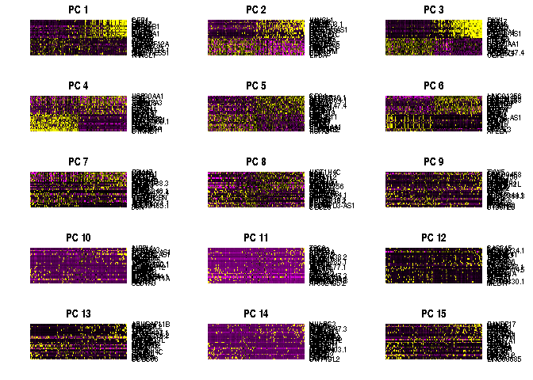
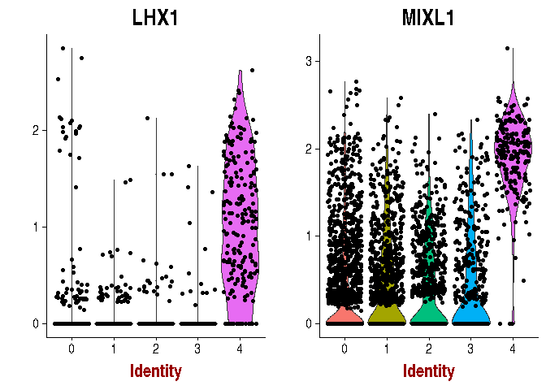

Exploratory analysis pipeline; Seurat
================
German Novakovskiy
December 21, 2018

    ## Loading required package: ggplot2

    ## Loading required package: cowplot

    ## 
    ## Attaching package: 'cowplot'

    ## The following object is masked from 'package:ggplot2':
    ## 
    ##     ggsave

    ## Loading required package: Matrix

    ## 
    ## Attaching package: 'dplyr'

    ## The following objects are masked from 'package:stats':
    ## 
    ##     filter, lag

    ## The following objects are masked from 'package:base':
    ## 
    ##     intersect, setdiff, setequal, union

Followed by [this tutorial](https://satijalab.org/seurat/pbmc3k_tutorial.html).

Setup the Seurat Object
-----------------------

``` r
#Loading the data
data.dir <-  "../../Sox17Ng_36h_German/filtered_feature_bc_matrix/"
esc.data <- Read10X(data.dir = data.dir)

#for visualization purporse
x <- row.names(esc.data)
x <- sapply(x, function(x){unlist(strsplit(x, split = "_____"))[2]})
names(x) <- NULL
x[1] <- "Neogreen"

rownames(esc.data) <- x
rm(x)

# Initialize the Seurat object with the raw (non-normalized data).  Keep all
# genes expressed in >= 7 cells (~0.1% of the data). Keep all cells with at
# least 200 detected genes
esc <- CreateSeuratObject(raw.data = esc.data, min.cells = 7, min.genes = 200, 
    project = "10X_ESC")
```

QC and selecting cells for further analysis
-------------------------------------------

``` r
# The number of genes and UMIs (nGene and nUMI) are automatically calculated
# for every object by Seurat.  For non-UMI data, nUMI represents the sum of
# the non-normalized values within a cell We calculate the percentage of
# mitochondrial genes here and store it in percent.mito using AddMetaData.
# We use object@raw.data since this represents non-transformed and
# non-log-normalized counts The % of UMI mapping to MT-genes is a common
# scRNA-seq QC metric.
mito.genes <- grep(pattern = "^MT-", x = rownames(x = esc@data), value = TRUE)
percent.mito <- Matrix::colSums(esc@raw.data[mito.genes, ])/Matrix::colSums(esc@raw.data)

# AddMetaData adds columns to object@meta.data, and is a great place to
# stash QC stats
esc <- AddMetaData(object = esc, metadata = percent.mito, col.name = "percent.mito")
VlnPlot(object = esc, features.plot = c("nGene", "nUMI", "percent.mito"), nCol = 3, point.size.use = 0.005)
```


``` r
# GenePlot is typically used to visualize gene-gene relationships, but can
# be used for anything calculated by the object, i.e. columns in
# object@meta.data, PC scores etc.  Since there is a rare subset of cells
# with an outlier level of high mitochondrial percentage and also low UMI
# content, we filter these as well
par(mfrow = c(1, 2))
GenePlot(object = esc, gene1 = "nUMI", gene2 = "percent.mito", pch.use = 16, cex.use = 0.5)
GenePlot(object = esc, gene1 = "nUMI", gene2 = "nGene", pch.use = 16, cex.use = 0.5)
```


``` r
# We filter out cells that have unique gene counts over 2,500 or less than
# 200 Note that low.thresholds and high.thresholds are used to define a
# 'gate'.  -Inf and Inf should be used if you don't want a lower or upper
# threshold.
esc <- FilterCells(object = esc, subset.names = c("nGene", "percent.mito"), 
    low.thresholds = c(200, -Inf), high.thresholds = c(Inf, 0.05))
```

Normalizing the data
--------------------

After removing unwanted cells from the dataset, the next step is to normalize the data. By default, we employ a global-scaling normalization method “LogNormalize” that normalizes the gene expression measurements for each cell by the total expression, multiplies this by a scale factor (10,000 by default), and log-transforms the result. (Thin about Scran normalization from hemberg approach).

``` r
esc <- NormalizeData(object = esc, normalization.method = "LogNormalize", 
    scale.factor = 10000)
```

Detection of variable genes across the single cells
---------------------------------------------------

Seurat calculates highly variable genes and focuses on these for downstream analysis. FindVariableGenes calculates the average expression and dispersion for each gene, places these genes into bins, and then calculates a z-score for dispersion within each bin. This helps control for the relationship between variability and average expression. This function is unchanged from (Macosko et al.), but new methods for variable gene expression identification are coming soon. We suggest that users set these parameters to mark visual outliers on the dispersion plot, but the exact parameter settings may vary based on the data type, heterogeneity in the sample, and normalization strategy. The parameters here represent typical parameter settings for UMI data that is normalized to a total of 1e4 molecules:

``` r
esc <- FindVariableGenes(object = esc, mean.function = ExpMean, dispersion.function = LogVMR, 
    x.low.cutoff = 0.0125, x.high.cutoff = 3, y.cutoff = 0.5)
```


``` r
length(x = esc@var.genes)
```

    ## [1] 3298

Scaling the data and removing unwanted sources of variation
-----------------------------------------------------------

Our single cell dataset likely contains ‘uninteresting’ sources of variation. This could include not only technical noise, but batch effects, or even biological sources of variation (cell cycle stage). Regressing these signals [out](https://stats.stackexchange.com/questions/3944/explain-model-adjustment-in-plain-english) of the analysis can improve downstream dimensionality reduction and clustering.

We check the cell cycle for confounding effect. And then scale data for UMI counts, MT genes and difference in proliferating cycles (S and G2/M). We should regress out the difference between the G2M and S phase scores. This means that signals separating non-cycling cells and cycling cells will be maintained, but differences in cell cycle phase amongst proliferating cells (which are often uninteresting), will be regressed out of the data (because we have stem cells):

``` r
#cell cycle markers
cc.genes <- readLines(con = "cell_cycle_vignette_files/regev_lab_cell_cycle_genes.txt")
#cc.genes <- sapply(cc.genes, function(x){ paste("GRCh38_____", x, sep="")})
#names(cc.genes) <- NULL

# We can segregate this list into markers of G2/M phase and markers of S
# phase
s.genes <- cc.genes[1:43]
g2m.genes <- cc.genes[44:97]

esc <- ScaleData(object = esc, display.progress = FALSE)
#only NASP is in PC4, there are no other genes, related to cell-cycle; however a lot of are MT genes, which is expected
esc <- RunPCA(object = esc, pc.genes = esc@var.genes, pcs.print = 1:4, 
    genes.print = 10)
```

    ## [1] "PC1"
    ##  [1] "SNRPD2"     "ATP5ME"     "PSMA4"      "SNRPG"      "UQCRB"     
    ##  [6] "RPL36A"     "SON"        "COX6C"      "AC106864.1" "C1orf56"   
    ## [1] ""
    ##  [1] "MT-ND1"    "MT-ND2"    "MTRNR2L1"  "MT-ATP6"   "HIST1H4C" 
    ##  [6] "MT-ND3"    "HSP90B1"   "PNISR"     "MTRNR2L12" "HACD3"    
    ## [1] ""
    ## [1] ""
    ## [1] "PC2"
    ##  [1] "HSP90AA1" "HSPD1"    "HNRNPA3"  "SSB"      "HNRNPM"   "HDAC2"   
    ##  [7] "PSMA3"    "DNAJA1"   "HSPA8"    "PDHB"    
    ## [1] ""
    ##  [1] "KANSL1"     "HOOK2"      "TAF1D"      "POLR2J3.1"  "CHD9"      
    ##  [6] "GABPB1-AS1" "C21orf58"   "UPF2"       "AC023034.1" "DCLRE1C"   
    ## [1] ""
    ## [1] ""
    ## [1] "PC3"
    ##  [1] "DKK1"    "LHX1"    "CER1"    "FGF17"   "GATA6"   "HAS2"    "APLNR"  
    ##  [8] "ARL4D"   "DKK4"    "CYP26A1"
    ## [1] ""
    ##  [1] "AL353747.4" "POLR3G"     "UGP2"       "CD24"       "VASH2"     
    ##  [6] "ARL4A"      "APELA"      "PIM2"       "ADM"        "VSNL1"     
    ## [1] ""
    ## [1] ""
    ## [1] "PC4"
    ##  [1] "CTNNB1"     "HNRNPH1"    "LRRC75A"    "SOX11"      "B3GNT7"    
    ##  [6] "AC092069.1" "SET"        "C1orf56"    "WTAP"       "CDC42SE1"  
    ## [1] ""
    ##  [1] "HSP90AA1" "KANSL1"   "SSB"      "SON"      "PDIA3"    "U2SURP"  
    ##  [7] "FUS"      "NASP"     "UPF2"     "ATIC"    
    ## [1] ""
    ## [1] ""

``` r
esc <- CellCycleScoring(object = esc, s.genes = s.genes, g2m.genes = g2m.genes, 
    set.ident = TRUE)

# view cell cycle scores and phase assignments
head(x = esc@meta.data)
```

    ##                  nGene  nUMI orig.ident percent.mito     S.Score
    ## AAACCTGAGATGGGTC  4710 29613    10X_ESC  0.034387245 -0.12824628
    ## AAACCTGCATACGCTA  1412  4473    10X_ESC  0.002236136  0.03569961
    ## AAACCTGGTTGGAGGT  3890 21177    10X_ESC  0.040661157  0.13431762
    ## AAACCTGTCGGCGCTA   947  2429    10X_ESC  0.005763689  0.02659423
    ## AAACGGGAGACGCTTT  4774 34914    10X_ESC  0.032426239 -0.01910303
    ## AAACGGGAGTGAAGAG  3442 17309    10X_ESC  0.044143988 -0.01341197
    ##                    G2M.Score Phase old.ident
    ## AAACCTGAGATGGGTC  0.04967858   G2M   10X_ESC
    ## AAACCTGCATACGCTA  0.17187996   G2M   10X_ESC
    ## AAACCTGGTTGGAGGT -0.09794841     S   10X_ESC
    ## AAACCTGTCGGCGCTA -0.04736065     S   10X_ESC
    ## AAACGGGAGACGCTTT -0.06837157    G1   10X_ESC
    ## AAACGGGAGTGAAGAG -0.01526836    G1   10X_ESC

``` r
esc <- RunPCA(object = esc, pc.genes = c(s.genes, g2m.genes), do.print = FALSE)
PCAPlot(object = esc)
```

 For each gene, Seurat models the relationship between gene expression and the S and G2M cell cycle scores. The scaled residuals of this model represent a ‘corrected’ expression matrix, that can be used downstream for dimensional reduction.

``` r
esc@meta.data$CC.Difference <- esc@meta.data$S.Score - esc@meta.data$G2M.Score
esc <- ScaleData(object = esc, vars.to.regress = c("nUMI", "percent.mito", "CC.Difference"), display.progress = FALSE)
#esc <- ScaleData(object = esc, vars.to.regress = c("nUMI", "percent.mito"), display.progress = FALSE)

esc <- RunPCA(object = esc, pc.genes = c(s.genes, g2m.genes), do.print = FALSE)
PCAPlot(object = esc)
```


Linear dimensional reduction
----------------------------

Running dimensionality reduction on highly variable genes can improve performance. However, with UMI data - particularly after regressing out technical variables, PCA returns similar (albeit slower) results when run on much larger subsets of genes, including the whole transcriptome.

``` r
esc <- RunPCA(object = esc, pc.genes = esc@var.genes, pcs.compute = 100, pcs.print = 1:4, do.print=FALSE)
```

``` r
PCAPlot(object = esc, dim.1 = 1, dim.2 = 2)
```


``` r
#x <- esc@meta.data
#x <- x[ , !(names(x) %in% c("Phase"))]
#esc@meta.data <- x
PCAPlot(object = esc, dim.1 = 1, dim.2 = 2, group.by='old.ident')
```


PCHeatmap allows for easy exploration of the primary sources of heterogeneity in a dataset, and can be useful when trying to decide which PCs to include for further downstream analyses. Both cells and genes are ordered according to their PCA scores.

``` r
PCHeatmap(object = esc, pc.use = 1, cells.use = 500, do.balanced = TRUE, label.columns = FALSE)
```


``` r
PCHeatmap(object = esc, pc.use = 1:15, cells.use = 500, do.balanced = TRUE, 
    label.columns = FALSE, use.full = FALSE)
```



``` r
PCElbowPlot(object = esc)
```


Clustering and t-SNE
--------------------

``` r
esc <- FindClusters(object = esc, reduction.type = "pca", dims.use = 1:40, 
    resolution = 0.6, print.output = 0, save.SNN = TRUE)

esc <- RunTSNE(object = esc, dims.use = 1:40, do.fast = TRUE)

TSNEPlot(object = esc)
```


``` r
table(esc@ident) 
```

    ## 
    ##    0    1    2    3    4 
    ## 1606  930  728  458  200

200 cells are in cluster 4, which is believed to be primitive streak

Finding of bio markerks for each cluster:

``` r
# find markers for every cluster compared to all remaining cells, report
# only the positive ones
esc.markers <- FindAllMarkers(object = esc, only.pos = TRUE, min.pct = 0.25, 
    thresh.use = 0.25)

esc.markers %>% group_by(cluster) %>% top_n(10, avg_logFC) %>% filter(cluster == 4)
```

    ## # A tibble: 10 x 7
    ## # Groups:   cluster [1]
    ##        p_val avg_logFC pct.1 pct.2 p_val_adj cluster gene   
    ##        <dbl>     <dbl> <dbl> <dbl>     <dbl> <fct>   <chr>  
    ##  1 0.            1.18  0.875 0.037 0.        4       LHX1   
    ##  2 4.12e-298     1.19  0.935 0.084 7.47e-294 4       FGF17  
    ##  3 2.59e-205     1.05  0.925 0.145 4.68e-201 4       HAS2   
    ##  4 9.65e-197     1.62  0.805 0.102 1.75e-192 4       DKK4   
    ##  5 2.84e-193     2.21  0.945 0.185 5.14e-189 4       DKK1   
    ##  6 2.06e-146     1.14  0.895 0.221 3.72e-142 4       ARL4D  
    ##  7 6.78e-145     2.22  0.98  0.35  1.23e-140 4       CER1   
    ##  8 2.93e-133     1.53  0.865 0.217 5.31e-129 4       CYP26A1
    ##  9 4.63e-116     1.36  0.98  0.505 8.38e-112 4       MIXL1  
    ## 10 1.48e- 84     0.862 0.88  0.358 2.67e- 80 4       CA2

Cluster 4 is full with mesoderm and primitive streak markers.

If we check gene ontology enrichment of cluster 3 markers we see mostly negative regulation of gene expression, cell cycle and organelle organization.

Checking other key markers of primitive streak:

``` r
VlnPlot(object = esc, features.plot = c("EOMES", "CER1"))
```


``` r
VlnPlot(object = esc, features.plot = c("DKK4", "PDGFRA"))
```


``` r
VlnPlot(object = esc, features.plot = c("GSC", "GATA6"))
```


``` r
VlnPlot(object = esc, features.plot = c("LHX1", "MIXL1"))
```



Some of the markers of hESC:

``` r
VlnPlot(object = esc, features.plot = c("SOX2", "NANOG"))
```


``` r
VlnPlot(object = esc, features.plot = c("POU5F1", "DPPA4"))
```


``` r
VlnPlot(object = esc, features.plot = c("CDH1", "FGF2"))
```


Markers of DE - we don't have DE in this culture:

``` r
#SOX17 was filtered out as undetected gene, it was not expressed
VlnPlot(object = esc, features.plot = c("FOXA2", "CXCR4"))
```


``` r
#markers of primitive streak
FeaturePlot(object = esc, features.plot = c("CER1", "EOMES", "GATA6", "LHX1"), cols.use = c("grey", "red"), 
    reduction.use = "tsne")
```


``` r
#markers of primitive streak
FeaturePlot(object = esc, features.plot = c("MIXL1", "DKK4", "GSC", "DKK1"), cols.use = c("grey", "red"), 
    reduction.use = "tsne")
```


For stem cell markers:

``` r
FeaturePlot(object = esc, features.plot = c("SOX2", "NANOG", "CDH1", "DPPA4"), cols.use = c("grey", "red"), 
    reduction.use = "tsne")
```


``` r
top10 <- esc.markers %>% group_by(cluster) %>% top_n(10, avg_logFC)
# setting slim.col.label to TRUE will print just the cluster IDS instead of
# every cell name
DoHeatmap(object = esc, genes.use = top10$gene, slim.col.label = TRUE, remove.key = TRUE)
```


``` r
cluster4.markers <- FindMarkers(object = esc, ident.1 = 4, min.pct = 0.25)
print(x = head(x = cluster4.markers, n = 5))
```

    ##                   p_val avg_logFC pct.1 pct.2     p_val_adj
    ## LHX1       0.000000e+00 1.1758839 0.875 0.037  0.000000e+00
    ## GATA6      0.000000e+00 0.7983458 0.860 0.046  0.000000e+00
    ## FGF17     4.124157e-298 1.1860787 0.935 0.084 7.467612e-294
    ## GATA6-AS1 4.115433e-287 0.3588909 0.480 0.009 7.451814e-283
    ## APLNR     5.651889e-285 0.6685387 0.650 0.030 1.023388e-280

``` r
cluster3.markers <- FindMarkers(object = esc, ident.1 = 3, min.pct = 0.25)
print(x = head(x = cluster3.markers, n = 10))
```

    ##                    p_val avg_logFC pct.1 pct.2     p_val_adj
    ## HNRNPH1    2.012989e-193 1.3960521 0.974 0.757 3.644919e-189
    ## CTNNB1     2.485023e-183 1.4507988 0.917 0.504 4.499632e-179
    ## SET        5.778944e-157 0.7935100 0.989 0.908 1.046393e-152
    ## LRRC75A    2.814986e-132 0.7639521 0.648 0.195 5.097095e-128
    ## C1orf56    2.497816e-119 0.7659348 0.622 0.189 4.522795e-115
    ## AC092069.1 1.374890e-116 0.5467810 0.421 0.074 2.489513e-112
    ## PHKG1       2.255622e-95 0.4063239 0.343 0.057  4.084255e-91
    ## SOX11       1.758025e-88 0.7353301 0.736 0.419  3.183255e-84
    ## GIGYF1      6.299079e-87 0.4472768 0.528 0.168  1.140574e-82
    ## EIF5A       1.006465e-80 0.6039188 0.983 0.890  1.822407e-76

For testing:

``` r
current.cluster.ids <- c(0, 1, 2, 3, 4)
new.cluster.ids <- c("hESC", "hESC", "hESC", "CTNNB1+ cells", "APS")
x <- esc
x@ident <- plyr::mapvalues(x = x@ident, from = current.cluster.ids, to = new.cluster.ids)
TSNEPlot(object = x, do.label = TRUE, pt.size = 0.5, label.size = 6)
```


Among negative markers for APS cluster are hESC markerks: SOX2, NANOG, POU5F1, DPPA4. For CTNNB1+ cluster there is only one negative marker - CER1. Probably, CTNNB1+ cells, are intermidiate step from hESC to APS.
